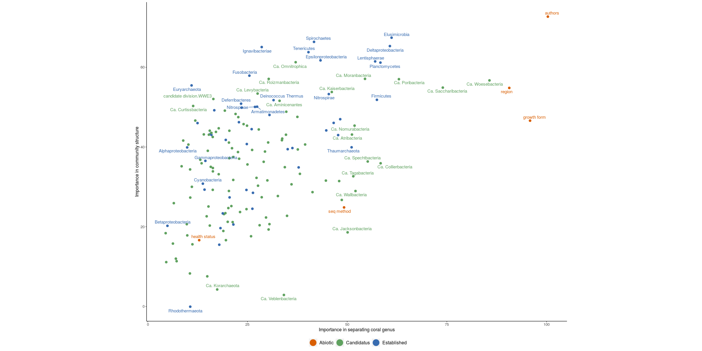
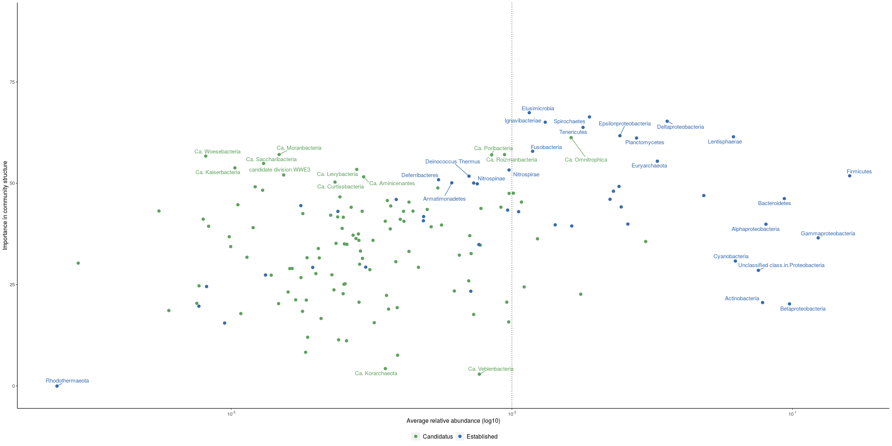
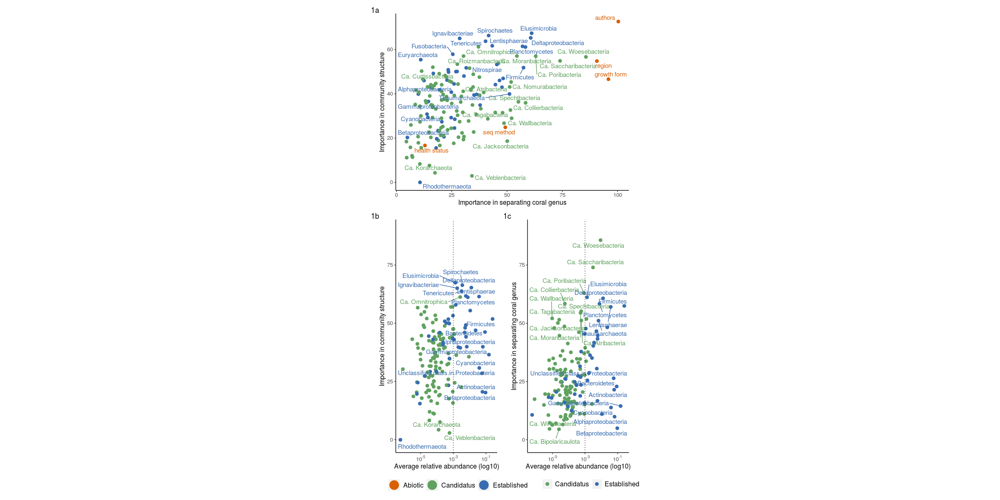

Holobiont project Random Forest
================
Arthur & Leticia
12/10/2019

# Random Forest Evaluation

This document contains the code witcht performs the random Forest method
with the objective to extract from the data: - The individuals that are
most important to classify the variables in this study.  
\- etc.  
You can find more about the method in the (Breiman’s
paper)\[“<https://link.springer.com/article/10.1023/A:1010933404324>”\]

## Libraries we used

``` r
library(tidyverse)
library(randomForest)
library(scales)
library(cowplot)
```

## Importing and tidying the data

``` r
data <- read.csv("input/detailed_abundance_phyla_157_corais_matrix_porcentagem_prot_divided_17abr2019.csv") %>%
  select(-1)

levels(data$health_status)[levels(data$health_status) == "iminent bleaching"] <- "bleached"
levels(data$health_status)[levels(data$health_status) == "signs of bleaching"] <- "bleached"
levels(data$health_status)[levels(data$health_status) == "bleaching event"] <- "bleached" 
levels(data$health_status)[levels(data$health_status) == "bleaching event "] <- "bleached"
levels(data$health_status)[levels(data$health_status) == "Cyanobacterial patches"] <- "Black Band Disease"

data_num <- data %>% select_if(is.numeric)

abundantes <- data_num %>% gather() %>% group_by(key) %>% 
  summarise(seila = mean(value)) %>% 
  filter(seila > 1/100) %>% pull(key)


data <- data %>% 
  mutate(
    seq_method = factor(
      case_when(
        .$seq_method %in% c("Illumina Genome Analyzer IIx", "Illumina HiSeq 1000",
                            "Illumina HiSeq 1000 WGS", "Illumina HiSeq 2000",
                            "Illumina HiSeq 2500", "Illumina HiSeq 2500 WGS",
                            "WGS illumina") ~ "Illumina",
        TRUE ~ "454"
      )
    )
  )

data <- data %>% filter(genus != "Fungia",
                        genus != "Pseudodiploria", 
                        !(.$genus == "Porites" & .$authors == "Thurber et al. 2009"),
                        !(.$genus == "Acropora" & .$region == "mesocosmos" & .$authors == "not published"),
                        !(.$genus == "Pocillopora" & .$region == "mesocosmos" & .$authors =="not published"),
                        !(.$genus == "Seriatopora" &.$region == "mesocosmos" & .$authors =="not published"),
                        !(.$id == "mgm4694757_prinseq_good_Crf1")) %>% 
  mutate(genus = factor(genus),
         authors = factor(authors),
         growth_form = factor(growth_form))
```

## Runinng the model

``` r
set.seed(2019)

community_structure <- randomForest(importance = TRUE, ntree = 50000,
                                    x = select(data, genus, seq_method, authors, region, growth_form,
                                               health_status,             
                                               Unclassified.class.in.Proteobacteria:Rhodothermaeota)
                                    )
genus_supervised <- randomForest(genus ~ .,
                                 importance = TRUE, ntree = 50000,
                                 select(data, genus, seq_method, authors, region, growth_form,
                                        health_status,             
                                        Unclassified.class.in.Proteobacteria:Rhodothermaeota)
                                 )

full_join(
  community_structure %>% importance() %>% as.data.frame() %>% rownames_to_column(var = "variables") %>% 
    select(MeanDecreaseAccuracy, MeanDecreaseGini,variables) %>% 
    mutate(rf_type = "community_structure") %>% 
    filter(variables != "genus") %>% 
    rename(mda_community = MeanDecreaseAccuracy, mdg_community = MeanDecreaseGini),
  genus_supervised %>% importance() %>% as.data.frame() %>% rownames_to_column(var = "variables") %>% 
    select(MeanDecreaseAccuracy, MeanDecreaseGini,variables) %>% 
    mutate(rf_type = "genus_supervised") %>% 
    rename(mda_genus = MeanDecreaseAccuracy, mdg_genus = MeanDecreaseGini),
  by = "variables"
) %>% 
  write_csv("outputs/random_forest/RF_impotance_per_variables.csv")
```

The RF csv output has a missing value at genus supervised importance in
the genus varibles because genus is the predicted classification
variable.

## Tidying the results output

``` r
plot_1_community_genus <- bind_cols(
  community_structure %>% importance() %>% as.data.frame() %>% rownames_to_column(var = "variables") %>% 
    select(MeanDecreaseAccuracy, MeanDecreaseGini,variables) %>% 
    mutate(rf_type = "community_structure") %>% 
    filter(variables != "genus") %>% 
    rename(mda_community = MeanDecreaseAccuracy, mdg_community = MeanDecreaseGini),
  genus_supervised %>% importance() %>% as.data.frame() %>% rownames_to_column(var = "variables") %>% 
    select(MeanDecreaseAccuracy, MeanDecreaseGini,variables) %>% 
    mutate(rf_type = "genus_supervised") %>% 
    rename(mda_genus = MeanDecreaseAccuracy, mdg_genus = MeanDecreaseGini)
) %>% 
  mutate(point_color = factor(case_when(
    .$variables %in% c("seq_method", "authors", "region", "growth_form", "health_status") ~ "Abiotic",
    str_detect(.$variables, "Candidat")                                                   ~ "Candidatus",
    str_detect(.$variables, "candidat")                                                   ~ "Candidatus",
    TRUE                                                                                  ~ "Bona fide"
  ))) %>% 
  mutate(variables = factor(
    str_replace(.$variables, pattern = "\\.", replacement = " ") %>%
      str_replace(pattern = "_", replacement = " ")))


#plot_2_community_health <- bind_cols(
#  community_structure %>% importance() %>% as.data.frame() %>% rownames_to_column(var = "variables") %>% 
#    select(MeanDecreaseAccuracy, MeanDecreaseGini,variables) %>% 
#    mutate(rf_type = "community_structure") %>% 
#    filter(variables != "health_status") %>% 
#    rename(mda_community = MeanDecreaseAccuracy, mdg_community = MeanDecreaseGini),
#  health_supervised %>% importance() %>% as.data.frame() %>% rownames_to_column(var = "variables") %>% 
#    select(MeanDecreaseAccuracy, MeanDecreaseGini,variables) %>% 
#    mutate(rf_type = "health_supervised") %>% 
#    rename(mda_health = MeanDecreaseAccuracy, mdg_health = MeanDecreaseGini)
#)%>% 
#  mutate(point_color = factor(case_when(
#    .$variables %in% c("seq_method", "authors", "region", "growth_form", "health_status") ~ "Abiotic",
#    str_detect(.$variables, "Candidat")                                                   ~ "Candidatus",
#    str_detect(.$variables, "candidat")                                                   ~ "Candidatus",
#    TRUE                                                                                  ~ "Bona fide"
#  ))) %>% 
#  mutate(variables = factor(
#    str_replace(.$variables, pattern = "\\.", replacement = " ") %>%
#      str_replace(pattern = "_", replacement = " ")))
```

## Ploting results

``` r
rf_plot <- ggplot(plot_1_community_genus, aes(mda_community, mda_genus, colour = point_color))+
  #geom_abline(slope = 1, intercept = 0, alpha = 0.5, color = "gray85")+
  geom_point()+
  ggrepel::geom_text_repel(data = filter(plot_1_community_genus,
                           mda_community > 50 | mda_community < 5 | mda_genus > 50 | point_color == "Abiotic"),force = 6,
             aes(mda_community, mda_genus, label = variables),
             size = 6)+
  labs(x = "Importance in community structure", y = "Genus importance",
       colour = NULL)+
  guides(colour = "none") +
  scale_colour_manual(values = c("Abiotic" = "#FFB23D", "Candidatus" = "#B36681",
                                 "Bona fide" = "#74BACC"))+
  theme_light()+
  expand_limits(
    x = c(- 15, 73)
  )+
  theme(axis.title.x = element_text(face="bold", size=14),
        axis.text.y = element_text(size = 12),
        axis.text.x = element_text(size = 12))+
  theme(axis.title.y = element_text(face="bold", size=14),
        #panel.grid.major.y = element_line(colour = "black")
        )+
  coord_flip()

ggplot2::ggsave(plot = rf_plot, file="outputs/random_forest/Random_Forest_model_importance_community_and_genus.svg", width = 160, height = 80, units = "mm", scale = 4)
ggplot2::ggsave(plot = rf_plot, file="outputs/random_forest/Random_Forest_model_importance_community_and_genus.png", width = 160, height = 80, units = "mm", scale = 4)
ggplot2::ggsave(plot = rf_plot, file="outputs/random_forest/Random_Forest_model_importance_community_and_genus.pdf", width = 160, height = 80, units = "mm", scale = 4)
rf_plot
```

<!-- -->

``` r
abund_media <- data_num %>% gather() %>% group_by(key) %>% 
  summarise(media = mean(value)) %>% 
  rename(variables = key)

df_abund_imp <- plot_1_community_genus %>% 
  filter(point_color != "Abiotic") %>% 
  select(mda_community, point_color, variables) %>% 
  arrange(variables) %>% 
  bind_cols(abund_media)
  
abund_comm <- df_abund_imp %>% 
  ggplot(aes(x = media, y = mda_community))+
  labs(x = "Mean abundance (log 10)", y = "Importance in community structure",
       colour = "Taxa")+
  scale_x_log10(labels = trans_format("log10", math_format(10^.x)))+
  annotation_logticks(colour = "gray80",sides = "bottom")+
  geom_smooth(color = "#FFB23D", fill = "gray85",
              method = "loess")+
  scale_colour_manual(values = c("Candidatus" = "#B36681",
                                 "Bona fide" = "#74BACC"))+
  geom_point(aes(colour = point_color))+
  ggrepel::geom_text_repel(data = df_abund_imp %>% 
                             filter(mda_community >= 50| media >= 0.05| variables == "Cyanobacteria" | mda_community < 5), force = 15,
                           aes(colour = point_color, label = variables),
                           size = 6)+
  geom_vline(xintercept = .1/100, linetype = 3)+
  theme_light()+
  expand_limits(
    y = c(- 15, 73)
  )+
  #ylim(c(0,32))+
  theme(legend.position = c(0.71, 0.2), legend.background = element_blank(),
        legend.title.align = 0.5, axis.title.y = element_blank(),
        axis.text.y = element_text(face="bold", size=14),
        axis.text.x = element_text(size = 12),
        axis.title.x = element_text(face="bold", size=14),
        #panel.grid.major.y = element_line(colour = 'black'), 
        axis.ticks.y = element_blank(),
        panel.grid.minor.y = element_blank())

ggplot2::ggsave(abund_comm, file = "outputs/random_forest/mean_abundance_imp_community.png", width = 160, height = 80, units = "mm", scale = 4)
ggplot2::ggsave(abund_comm, file = "outputs/random_forest/mean_abundance_imp_community.pdf", width = 160, height = 80, units = "mm", scale = 4)
ggplot2::ggsave(abund_comm, file = "outputs/random_forest/mean_abundance_imp_community.svg", width = 160, height = 80, units = "mm", scale = 4)
abund_comm
```

<!-- -->
\#\# Final Panel

``` r
plot_grid(rf_plot, abund_comm, rel_widths = c(1,0.7), ncol = 2,
          #align = "h",
          nrow = 1,labels = c("A", "B"),label_x = c(0,-0.01))
```

<!-- -->

``` r
ggplot2::ggsave(filename = paste0("outputs/random_forest/rf_panel_",Sys.Date(),".png"), width = 160, height = 80, units = "mm", scale = 4)
ggplot2::ggsave(filename = paste0("outputs/random_forest/rf_panel_",Sys.Date(),".svg"), width = 160, height = 80, units = "mm", scale = 4)
ggplot2::ggsave(filename = paste0("outputs/random_forest/rf_panel_",Sys.Date(),".pdf"), width = 160, height = 80, units = "mm", scale = 4)
```
